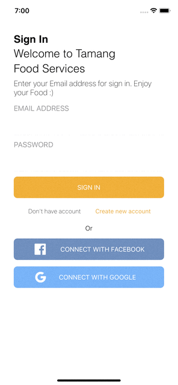
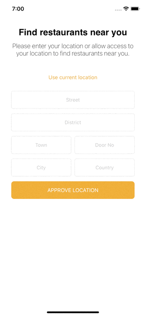
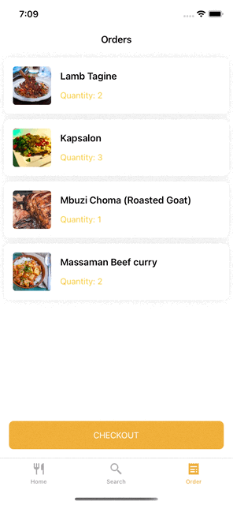

# *Tamang Food Service*

## Summary

In this project, an attempt was made to simulate a food ordering application. The user can create an order by logging in after first registering. The interface of the project was inspired by the [figma](https://www.figma.com/community/file/992304109173819815) project.

## Features

Incomplete features are being worked on.

- [x] Sign In/Up with email
- [x] Get current Location
- [x] Display of products
- [ ] Add to Cart and Checkout
- [ ] Sign In/Up Facebook/Google

## Requirements

- iOS 13.0+
- Xcode 12.5

## Packages

- Firebase
- Kingfisher
- ProgresHUD

## Screens

| Onboarding | Sign In/Up | Get Location | Home | Search | Order |
| --- | --- | --- | --- | --- | --- |
|  |  |  |  |  |  |

Huseyn Valiyev – [@Whosein](https://twitter.com/valiyevhuseyn) – huseynvaliyev98@gmail.com
